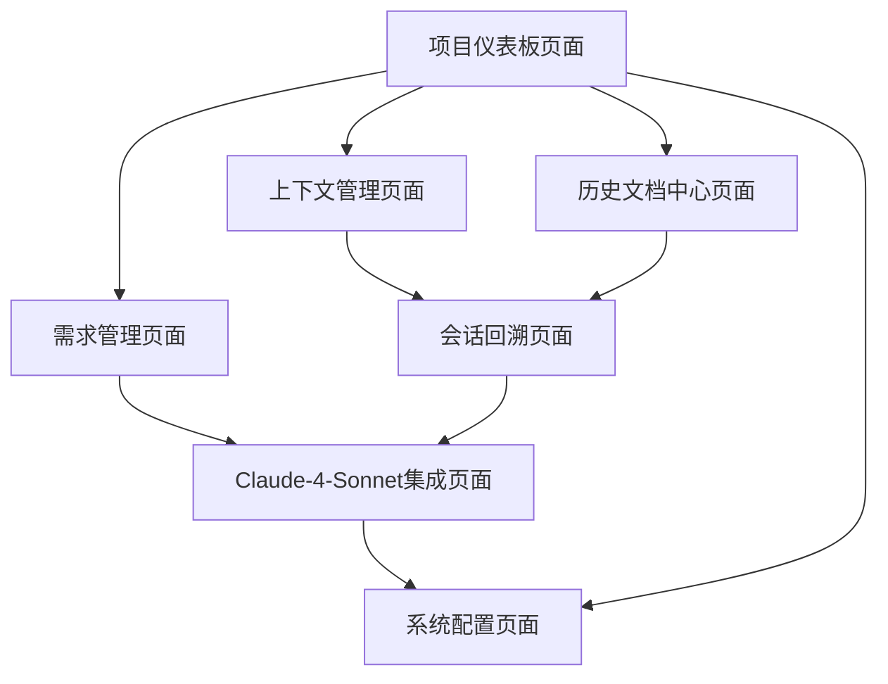

# TraeIDE项目偏离预防MCP产品需求文档

## 1. 产品概述

本MCP产品专为TraeIDE开发环境设计，基于Claude-4-Sonnet大模型能力和MCP协议，作为智能核心为开发者提供全方位支持，通过上下文管理、历史追踪、需求校验等解决方案，确保开发过程始终与核心目标一致。

MCP产品核心价值：通过MCP协议实现TraeIDE与智能服务的双向通信，增强Claude-4-Sonnet对项目历史上下文的理解与利用能力，采用金字塔式信息分层和分阶段处理机制，弥补大模型在长历史处理上的局限，减少70%以上因信息断裂导致的开发偏离问题。

目标市场：面向使用TraeIDE的开发团队，特别是需要长周期开发和频繁需求变更的项目团队，为其提供智能化的项目偏离预防解决方案。

## 2. 核心功能

### 2.1 用户角色

| 角色    | 注册方式        | 核心权限                                         |
| ----- | ----------- | -------------------------------------------- |
| 开发者   | TraeIDE账户集成 | 可创建项目、管理上下文快照、查看历史文档、提交新需求、在TraeIDE内调整所有功能参数 |
| 项目管理员 | 项目创建者或授权    | 可配置核心需求、设置校验阈值、管理需求变更审批、在TraeIDE内管理所有配置参数    |

### 2.2 功能模块

我们的TraeIDE项目偏离预防MCP产品包含以下主要页面，所有页面均在TraeIDE内展示并支持实时参数调整：

1. **项目仪表板页面**：项目概览、上下文状态监控、偏离预警展示（支持TraeIDE内参数配置）
2. **上下文管理页面**：快照创建与恢复、上下文压缩配置、历史回顾（支持TraeIDE内实时调整）
3. **需求管理页面**：核心需求定义、新需求评估、需求变更追踪（支持TraeIDE内配置管理）
4. **历史文档中心页面**：文档分类浏览、智能检索、文档关联展示（支持TraeIDE内展示和配置）
5. **会话回溯页面**：历史会话管理、智能回溯、会话复用功能（支持TraeIDE内完整展示）
6. **Claude-4-Sonnet集成页面**：提示词优化、分阶段处理配置、知识图谱展示（支持TraeIDE内参数调整）
7. **系统配置页面**：插件设置、阈值配置、集成参数管理（支持TraeIDE内统一管理）

### 2.3 页面详情

| 页面名称                | 模块名称     | 功能描述                                                    |
| ------------------- | -------- | ------------------------------------------------------- |
| 项目仪表板页面             | 项目概览模块   | 在TraeIDE内显示项目基本信息、当前开发状态、核心需求完成度，支持实时参数调整               |
| 项目仪表板页面             | 偏离预警模块   | 在TraeIDE内实时监控需求关联度、显示预警信息、提供快速修正建议，可调整预警阈值              |
| 项目仪表板页面             | 上下文状态模块  | 在TraeIDE内展示最近快照信息、上下文完整性状态、恢复建议，支持状态配置                  |
| 上下文管理页面             | 快照管理模块   | 在TraeIDE内自动捕获开发中断点、创建包含代码结构和变量定义的快照，可配置快照频率和保存策略        |
| 上下文管理页面             | 上下文压缩模块  | 在TraeIDE内实现金字塔式信息分层（300字核心需求→功能模块关联图→完整细节），可调整摘要字数和分层深度 |
| 上下文管理页面             | 快速回顾模块   | 在TraeIDE内恢复开发时呈现最近快照摘要、突出核心约束，可配置回顾内容和展示方式              |
| 需求管理页面              | 核心需求定义模块 | 在TraeIDE内设置项目核心需求、建立需求层级结构，可调整关联度预警阈值（默认60%）            |
| 需求管理页面              | 新需求评估模块  | 在TraeIDE内评估新需求与核心目标关联度（0-100%），可配置评估规则和优先级策略            |
| 需求管理页面              | 需求冲突检测模块 | 在TraeIDE内检测新需求与历史需求冲突，可调整冲突检测敏感度和解决策略                   |
| 历史文档中心页面            | 文档分类浏览模块 | 在TraeIDE内按类型浏览文档、文档层级展示，支持自定义分类规则和展示方式                  |
| 历史文档中心页面            | 智能检索模块   | 在TraeIDE内支持自然语言查询、多维度搜索，可调整检索精度和结果数量                    |
| 历史文档中心页面            | 自动文档生成模块 | 在TraeIDE内维护结构化项目文档，可配置文档模板和生成规则                         |
| 会话回溯页面              | 会话管理模块   | 在TraeIDE内保存项目相关会话、会话分类标记，可配置保存策略和分类规则                   |
| 会话回溯页面              | 智能回溯模块   | 在TraeIDE内新需求输入时主动提供相关历史实现思路，可调整相似度阈值和推荐策略               |
| 会话回溯页面              | 会话复用模块   | 在TraeIDE内推荐可复用的历史解决方案，可配置复用规则和应用策略                      |
| Claude-4-Sonnet集成页面 | 提示词优化模块  | 在TraeIDE内按格式生成响应，可手动调整提示词模板和优化策略                        |
| Claude-4-Sonnet集成页面 | 分阶段处理模块  | 在TraeIDE内实现分阶段处理，可配置分解粒度和验证规则                           |
| Claude-4-Sonnet集成页面 | 知识图谱模块   | 在TraeIDE内构建项目实体关系图，支持图谱结构调整和关联规则配置                      |
| 系统配置页面              | 插件设置模块   | 在TraeIDE内进行基础参数配置、集成设置，支持实时参数调整                         |
| 系统配置页面              | 阈值配置模块   | 在TraeIDE内设置偏离预警阈值、压缩参数，支持性能优化配置                         |

## 3. Claude-4-Sonnet工作准则

### 3.1 上下文管理准则

* 自动捕获开发中断点，创建包含代码结构、变量定义和核心逻辑的快照

* 恢复开发时，先呈现最近快照摘要，突出核心约束、未完成任务和关键逻辑

* 采用金字塔式信息分层：300字核心需求与约束→功能模块关联图→完整细节，确保在处理范围内

### 3.2 历史文档处理准则

* 维护结构化项目文档，包含需求描述→实现方案→代码变更→验证结果完整链条

* 支持多维度检索，能理解自然语言查询并返回相关代码和会话记录

* 新内容产生时，自动关联到相应文档章节，保持信息一致性

### 3.3 需求管理流程准则

* 评估新需求与核心目标的关联度（0-100%），低于60%自动预警

* 分析新需求对现有架构的影响范围和实现成本，提供优先级建议

* 检测新需求与历史需求的冲突，给出明确的冲突点和历史依据

### 3.4 会话回溯利用准则

* 新需求输入时，主动提供相关的历史实现思路、决策依据和问题解决方案

* 推荐可复用的历史解决方案，支持新需求"继承"历史会话上下文

* 以时间线形式展示会话历程，突出关键决策节点

### 3.5 交互规范准则

* 生成响应时遵循格式：核心约束→当前任务分析→关联历史参考→具体方案

* 处理长上下文时采用分阶段方式：先理解历史摘要→生成初步方案→验证一致性

* 发现潜在偏差时，明确指出偏差点并提供历史依据

## 4. 核心流程

### 开发者主要操作流程：

1. **项目初始化流程**：开发者创建项目 → 导入核心需求与约束 → 系统生成初始上下文基线 → 设置开发节点与校验点

2. **日常开发流程**：查看项目仪表板 → 检查偏离预警 → 进行开发工作 → 系统自动创建快照 → 更新文档记录

3. **新需求处理流程**：输入新需求描述 → 系统检索相关历史 → 查看需求关联报告（关联度评估、影响范围分析） → Claude-4-Sonnet按规范格式生成方案 → 一致性校验和偏差检测 → 确认并更新文档

4. **中断恢复流程**：系统检测开发恢复 → 展示最近快照摘要（核心约束、未完成任务、关键逻辑） → 选择上下文回顾 → 关联历史会话 → 配置Claude-4-Sonnet上下文环境

### 项目管理员操作流程：

1. **项目配置流程**：设置核心需求层级 → 配置偏离预警阈值 → 设置需求变更审批流程 → 配置Claude-4-Sonnet参数

2. **需求管理流程**：审批需求变更 → 分析影响范围 → 更新需求文档 → 通知相关开发者

## 5. 技术架构与集成方式

### 5.1 TraeIDE集成方案

#### 5.1.1 MCP（模型上下文协议）集成方式（推荐）

* **集成原理**：基于MCP协议与TraeIDE建立标准化双向通信接口

* **优势**：

  * 标准化协议，兼容性强

  * 支持实时双向通信，TraeIDE可主动调用MCP服务

  * 便于版本升级维护

  * 与其他MCP兼容工具协同工作

* **实现方式**：

  * 通过MCP Server提供上下文管理、需求分析服务

  * 支持TraeIDE作为MCP Client主动调用产品功能

  * 实现代码上下文获取、文档生成、会话管理等核心接口

  * TraeIDE可在特定事件（代码变更、项目打开等）时主动触发偏离检测

#### 5.1.2 传统插件集成方式（备选）

* **集成原理**：作为TraeIDE原生插件直接集成到IDE环境中

* **优势**：

  * 深度集成，性能优化

  * 直接访问IDE内部API

  * 用户体验更加无缝

* **实现方式**：

  * 基于TraeIDE插件开发框架

  * 直接调用IDE的代码分析、文件管理API

  * 集成到IDE菜单、工具栏和侧边栏

### 5.2 技术要求

#### 5.2.1 核心技术栈

1. **前端技术**：

   * 基于Web技术栈（HTML5/CSS3/JavaScript）

   * 现代前端框架（推荐Vue.js或React）

   * 支持响应式设计和组件化开发

2. **后端服务**：

   * Node.js + Express 或 Python + FastAPI

   * MCP协议服务器实现

   * RESTful API设计，支持WebSocket实时通信

3. **数据存储**：

   * 轻量级数据库（SQLite或LevelDB）用于本地数据存储

   * 支持增量索引和全文搜索

   * 数据版本控制和备份机制

#### 5.2.2 集成接口标准

1. **MCP接口标准**：

   * 实现标准MCP协议资源管理接口

   * 支持上下文获取、文档检索、会话管理等核心功能

   * 提供异步处理和状态通知机制

2. **TraeIDE API适配**：

   * 代码上下文获取接口

   * 文件系统访问接口

   * 项目配置管理接口

   * 用户交互界面集成

3. **Claude-4-Sonnet集成**：

   * API请求格式优化和参数调整

   * 上下文长度管理和分块处理

   * 响应结果解析和格式化

#### 5.2.3 性能与安全要求

1. **性能指标**：

   * 接口响应时间 < 1秒

   * 大文档检索时间 < 3秒

   * 内存占用 < 200MB

   * 支持并发用户 ≥ 10人

2. **安全要求**：

   * 本地数据加密存储

   * API密钥安全管理

   * 用户隐私数据保护

   * 代码内容访问权限控制

### 5.3 部署与分发

#### 5.3.1 MCP部署方式

* 作为独立MCP Server服务运行

* 支持本地部署，无需云端依赖

* 通过MCP协议与TraeIDE通信

* 便于跨平台使用和版本管理

#### 5.3.2 插件部署方式

* 打包为TraeIDE插件格式

* 通过TraeIDE插件市场分发

* 支持自动更新和版本管理

* 深度IDE集成，优化用户体验

## 6. 用户界面设计

### 6.1 设计风格

* **主色调**：深蓝色 (#1E3A8A) 作为主色，浅蓝色 (#3B82F6) 作为辅助色

* **辅助色**：警告橙色 (#F59E0B)、成功绿色 (#10B981)、错误红色 (#EF4444)

* **按钮样式**：圆角矩形按钮，带有轻微阴影效果，悬停时有颜色渐变

* **字体**：主要使用 Microsoft YaHei 14px，标题使用 16px 加粗，代码区域使用 Consolas

* **布局风格**：TraeIDE内嵌式卡片布局，集成左侧导航栏，顶部状态栏，主内容区域采用网格布局

* **图标风格**：使用线性图标，配合项目管理和AI相关的图标元素，支持TraeIDE主题切换

* **参数调整**：所有功能参数支持实时调整，提供滑块、输入框、下拉选择等多种交互方式

### 6.2 页面设计概览

| 页面名称                | 模块名称     | UI元素                                             |
| ------------------- | -------- | ------------------------------------------------ |
| 项目仪表板页面             | 项目概览模块   | TraeIDE内嵌卡片式信息展示，进度条显示完成度，状态指示灯，参数配置面板，快速操作按钮    |
| 项目仪表板页面             | 偏离预警模块   | TraeIDE内警告色彩编码（绿色/黄色/红色），预警阈值调整滑块，弹出式详情面板，修正建议列表 |
| 上下文管理页面             | 快照管理模块   | TraeIDE内时间线式快照列表，快照频率配置器，缩略图预览，操作按钮组，保存策略选择器     |
| 上下文管理页面             | 上下文压缩模块  | TraeIDE内分层展示面板，摘要字数调整器，分层深度滑块，压缩比例配置面板           |
| 需求管理页面              | 核心需求定义模块 | TraeIDE内树形结构展示，关联度阈值调整器，拖拽排序，优先级标签，关联度可视化图表      |
| 需求管理页面              | 新需求评估模块  | TraeIDE内评分仪表盘，评估规则配置面板，优先级策略选择器，影响范围分析图表         |
| 历史文档中心页面            | 智能检索模块   | TraeIDE内搜索框带智能提示，检索精度调整器，过滤器面板，结果数量配置，结果列表带高亮    |
| 会话回溯页面              | 会话管理模块   | TraeIDE内聊天气泡式界面，保存策略配置，时间轴导航，相似度阈值调整器，标签分类       |
| Claude-4-Sonnet集成页面 | 知识图谱模块   | TraeIDE内交互式节点图，缩放平移功能，节点详情面板，关系线条标注，图谱结构调整器      |
| Claude-4-Sonnet集成页面 | 提示词优化模块  | TraeIDE内代码编辑器样式，提示词模板选择器，优化策略配置面板，实时预览窗口         |
| 系统配置页面              | 插件设置模块   | TraeIDE内表单式配置界面，分组折叠面板，实时验证提示，保存状态指示，参数调整控件      |

### 6.3 TraeIDE集成设计

本MCP产品完全集成到TraeIDE界面中，所有功能均在IDE内展示和操作：

* **界面集成**：所有功能页面作为TraeIDE面板展示，支持停靠和浮动

* **主题适配**：完全适配TraeIDE主题切换（深色/浅色模式）

* **参数调整**：所有功能参数直接在TraeIDE界面中实时调整，无需外部配置工具

* **交互优化**：支持TraeIDE键盘快捷键，右键菜单，拖拽操作等桌面端特有功能

* **配置管理**：参数配置实时生效，无需重启，配置状态与TraeIDE项目绑定

* **响应式布局**：支持最小1280x720分辨率，在更大屏幕上充分利用空间展示更多信息

* **性能优化**：界面渲染与TraeIDE同步，确保流畅的用户体验

